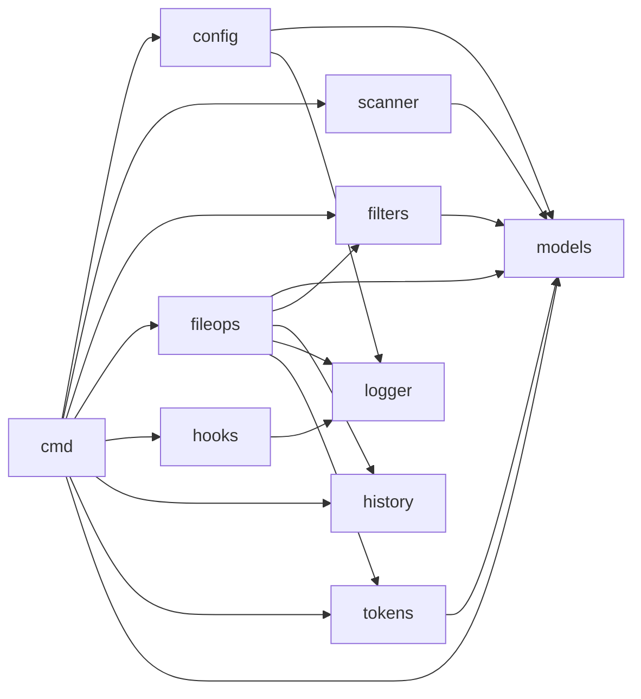
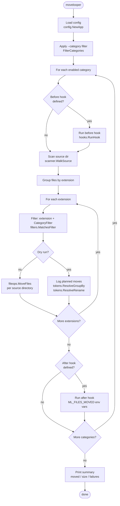
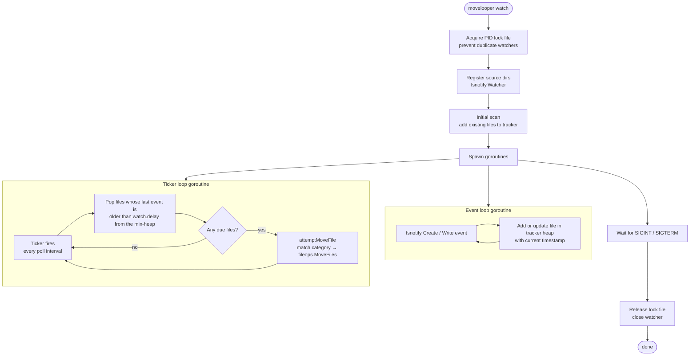
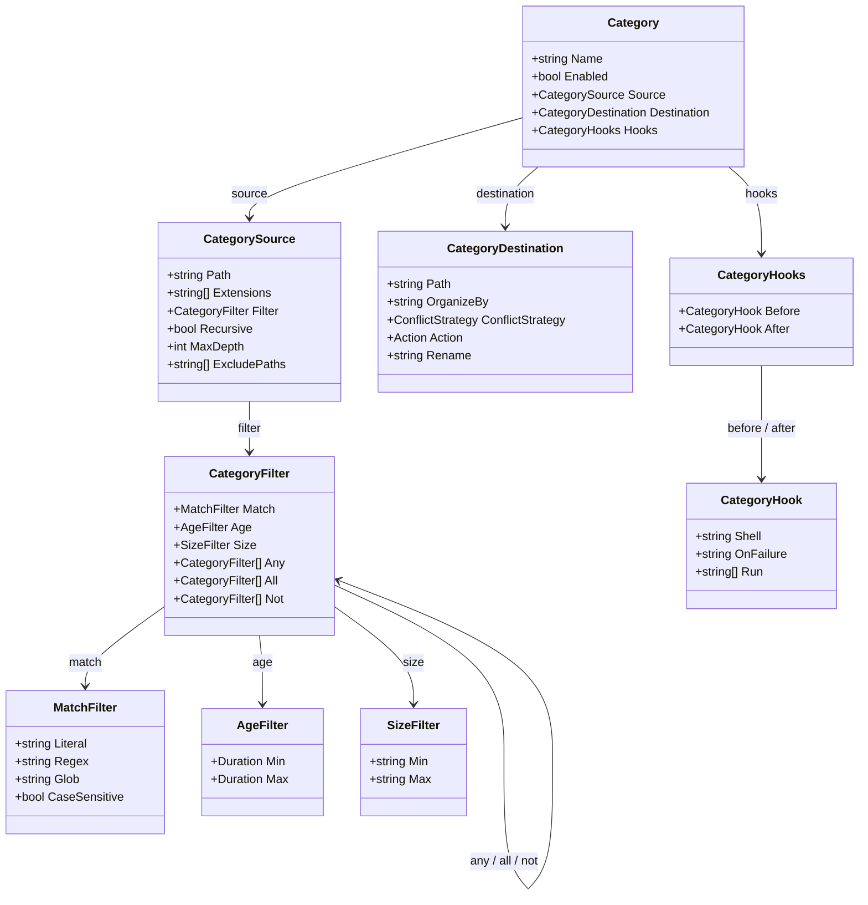
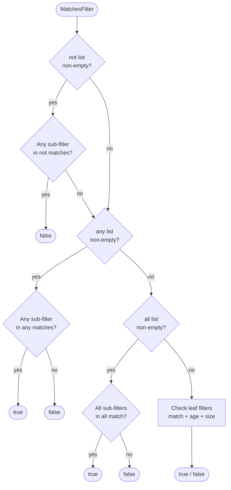
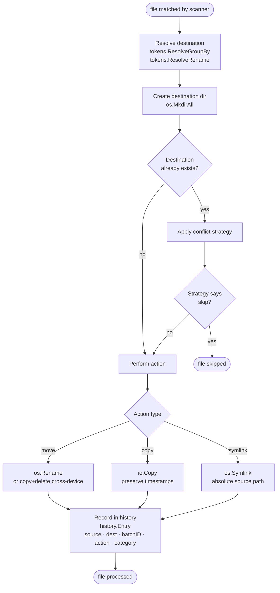
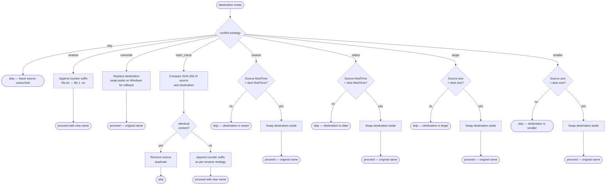

# movelooper Architecture

Diagrams describing the internal design and runtime behaviour of movelooper.

---

## Package dependencies

High-level view of which packages depend on which.

---

## One-shot run (`movelooper`)

What happens when you run `movelooper` (or `movelooper --dry-run`).

---

> **`action: archive`** bypasses the per-file `fileActions` path. Instead of moving each file, `processCategoryMove` collects all of the category's matched files and hands them to `internal/archive`, which streams them into one `.zip`/`.tar.gz` written atomically (temp file + rename). Sources are deleted only when `keep-source: false` and the archive was written successfully. Archive batches are recorded in history as non-undoable and are skipped in watch mode.

## Watch mode (`movelooper watch`)

Watch mode uses two goroutines: an event loop that listens to filesystem notifications and a ticker loop that moves files once their writes have stabilised.

> Hooks are intentionally skipped in watch mode. A warning is printed at startup for any category that defines before/after hooks.

---

## Category model

Structure of a single category entry in `movelooper.yaml`.

---

## Filter evaluation

`filters.MatchesFilter` evaluates a `CategoryFilter` tree recursively.
`not` is always checked first so it can veto regardless of `any`/`all`.

Each `CategoryFilter` leaf checks up to three independent constraints, all of which must pass (implicit AND):

| Field | Matches when |
|---|---|
| `match.glob` / `match.regex` / `match.literal` | filename satisfies the name pattern |
| `age.min` / `age.max` | modification time falls within the age window |
| `size.min` / `size.max` | file size falls within the size window |

---

## Per-file processing pipeline

What `fileops.MoveFiles` does for each individual file.

---

## Conflict strategies

How each strategy resolves a naming collision when the destination file already exists.

> **Swap-aside**: for strategies that replace the destination (`overwrite`, `newest`, `oldest`, `larger`, `smaller`), the existing file is renamed to a temporary backup before the action runs. If the action fails, the backup is restored atomically.
